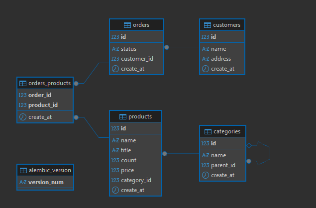

# Схема данных


# ```sql файлы лежат по пути "app/sql"```

# 1.Клонировать репозиторий:
```
git clone https://github.com/DmitryKireev69/test_task_aiti_guru.git
cd test_task_aiti_guru
```
# 2. Создать файл переменных окружения:
```   
В корне проекта есть шаблон:
.env.template
Создайте на его основе файл .env с указанием желаемых параметров:
 ```

# 3. Собрать и запустить контейнеры
```
docker compose up -d --build
После выполнения команда поднимет все
необходимые сервисы и создает бд и применяет миграции на неё.
Веб приложение доступно по адресу 127.0.0.1:8000
Документация приложения по адресу http://127.0.0.1:8000/docs/
```
# Запуск тестов
```
Что бы зайти в контейнер используем команду:
    docker exec -it test_task_aiti_guru-app-1 bash - в любой директории
    или
    docker compose exec -it app bash - в директории с проектом
Далее запускаем тесты командой "pytest" 
```